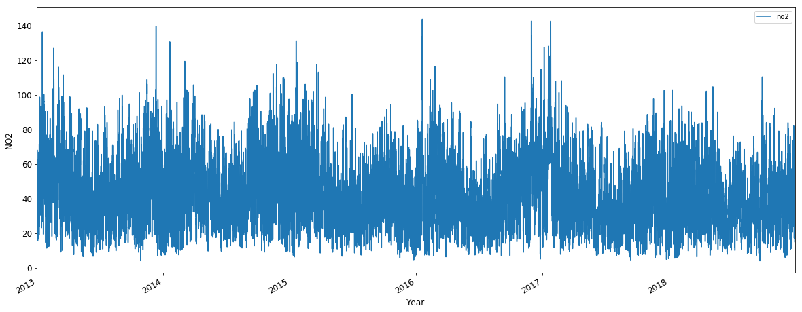
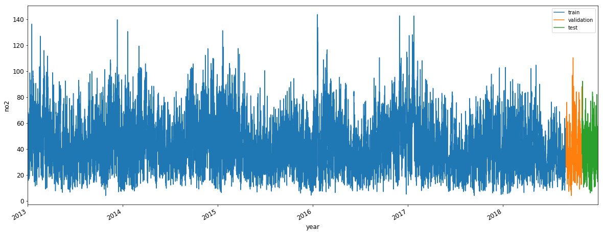
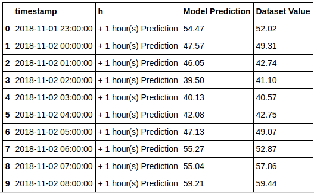
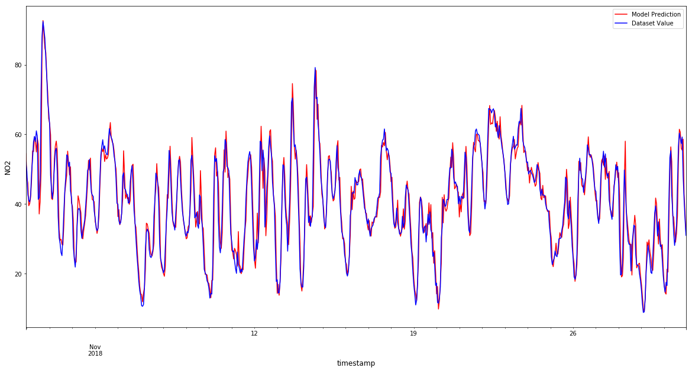

# Pollution
This roject pretends to forecast 24 hours Pollution for London City using NN. The selected pollutant was **NO2** and the selection criteria can be found in the  project [LdnAirAnalysis](https://github.com/Izel/LdnAirAnalysis)

## GRU - LSTM One step univariate model to forecast NO2
The present project uses a dataset previously cleaned and analyzed in the project [LdnAirAnalysis](https://github.com/Izel/LdnAirAnalysis). The GRU and LSTM NN will predict pollution for the next hour and indicate an alarm according to the **European Environmental Agency EEA.**

### Data Preparation
The imput data contains the values of the previous 24 hours `T=24` of NO2 concentrations. The choice of T=24 was random but should be selected through experimentation. Since the aim is to forecast the next hour, is necesary to define `HORIZON=1` to specify the forecasting horizon of 1 `(t+1)`

## Plots
### Overview of the dataset

  

### Training Vs Validation Vs Test

  

### LSTM Evaluation Table and Graph

  

  

